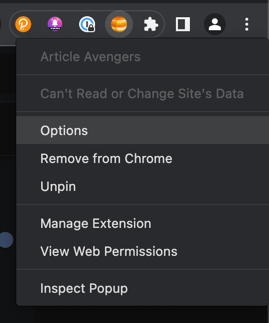
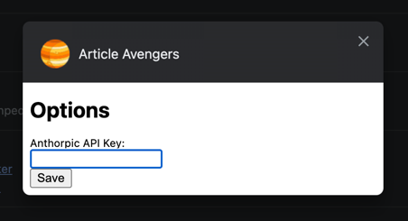
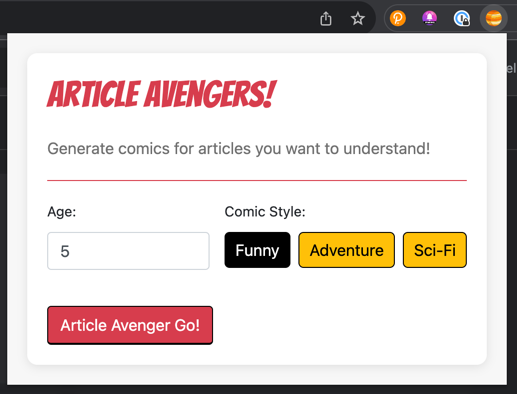

#  Article Avengers!

## Features

- Extracts text from the current tab you are on and generates a comic book style explanation of the content.

## Build the extension locally

### Pre-reqs:

1. node version >=18

    Update node instructions:

    ```bash
    brew install nvm
    nvm install 18 && nvm use 18
    node -v
    ```

2. Latest Chrome browser (some chromium browsers like brave may not work)


### Clone the repo and run the following on your local

```bash
cd chrome-extension
npm install
npm run watch
```

## How to load Chrome extension in browser?

Follow these instructions to load your extension in browser:
1. Open **chrome://extensions**
2. Check the **Developer mode** checkbox
3. Click on the **Load unpacked extension** button
4. Select the folder **my-extension/build**

## How to configure the extension

Note: This is only required one time

1. Update your Anthropic API key in extension options





## How it works

Enter age and pick the style of comic and hit Go!



Enjoy the comic syle summary of the web page content will be generated for you!


---

# FAQs & Troubleshooting guide for devs

> Note: `build` folder is created when you run either `npm run watch` (for development) or `npm run build` (for production) command.

## Why are my changes in `popup.js` file not reflecting?
You will have to close the extension popup window and open it again.<br>
Because opening the popup is same as reloading a page.

## Why are my changes in `contentScript.js` file not reflecting?
You will have to reload the extension and then reload the page.<br>
To reload an extension:
1. Open **chrome://extensions**
2. Locate your extension
3. Click the **Reload** icon adjacent to checkbox (_at bottom right of extension card_)

> Note: See [Issue 104610: Allow content scripts to update without reloading the extension](https://bugs.chromium.org/p/chromium/issues/detail?id=104610)

## Why are my changes in `background.js` file not reflecting?
You will have to reload the extension and then reload the page.<br>
To reload an extension:
1. Open **chrome://extensions**
2. Locate your extension
3. Click the **Reload** icon adjacent to checkbox (_at bottom right of extension card_)

## Why are my changes in Popup HTML file not reflecting?
You will have to close the extension popup window and open it again by clicking the extension icon from toolbar.<br>
Because opening the popup is same as reloading a page.

## Why are my changes in Override HTML file not reflecting?
You will have to reload the page and your changes will start reflecting.
To reload an extension:
1. Open **chrome://extensions**
2. Locate your extension
3. Click the **Reload** icon adjacent to checkbox (_at bottom right of extension card_)

## Why are my changes in DevTools Panel HTML file not reflecting?
DevTools Panel is nothing but a HTML page, which you can reload by following the instructions:
1. Right-click on the Panel HTML
2. Click **Reload Frame**
3. And the Panel HTML page will reload

## Open Issues
Issues that need a fix:
1. Style-sheet transfer to the build directory (popup.css)
2. Key **Anthropic Secret Key** saved in popup but windows does not close
3. Latency improvements to load faster ( Claude-2 is slower than Claude-v1.3 )
